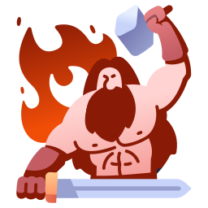

<div align="center">



<h1>Atomic Chain</h1>

<p><em>Build. Chain. Generate.</em><br/>
A node-based AI image & video editor — connect nodes to compose prompts, styles, cameras, lighting, materials, and effects, then run the whole pipeline with one shortcut.</p>

<p>
  
  <a href="https://atomicchain.vercel.app/editor">
    
  </a>
</p>

<p>
  <a href="https://atomicchain.vercel.app/editor"><b>🚀 Launch the editor →</b></a>
</p>

</div>

---

## Demo

https://github.com/RainPythonDeveloper/atomicchain/raw/main/demo-reel/video/AtomicChain.mp4

> If the player doesn't load, [**watch the demo reel directly**](./demo-reel/video/AtomicChain.mp4).

## Contents

- [Features](#features)
- [Nodes](#nodes)
- [Getting Started](#getting-started)
- [Environment Variables](#environment-variables)
- [Keyboard Shortcuts](#keyboard-shortcuts)
- [Stack](#stack)

## Features

- **Visual node editor** — drag, drop, and connect nodes on an infinite canvas powered by React Flow
- **20 node types** — prompts, styles, cameras, moods, materials, FX, time eras, and more
- **AI generation** — image generation via `/api/generate`, video animation via `/api/video`, prompt refinement via `/api/describe`
- **Batch mode** — generate up to 6 variations in one run via the Batch Generate node
- **Gallery** — every generated image is saved locally; persists across sessions
- **Canvas persistence** — workspace state (nodes + edges) auto-saves to `localStorage` and restores on reload
- **Node info popups** — every node has a `?` button that opens a full description with steps, connection guide, and a video tutorial slot
- **Retro UI** — custom dark theme with 3D button styling, glow effects, and monospace typography

## Nodes

### Input

| Node                  | Description                                                                      |
| --------------------- | -------------------------------------------------------------------------------- |
| **Prompt**      | Main text input for the generation                                               |
| **Negative**    | Words and concepts to exclude from the result                                    |
| **Surprise Me** | Slot-machine random scene generator — rolls subject, setting, detail, and style |
| **Combiner**    | Merges two prompt streams into one                                               |
| **Refine**      | Sends the current prompt to an AI model and rewrites it for better results       |

### Modifiers

| Node                    | Description                                                                   |
| ----------------------- | ----------------------------------------------------------------------------- |
| **Style**         | Visual presets — photorealistic, anime, oil painting, and more               |
| **Artist Style**  | Reference a specific artist or art movement with era selector                 |
| **Aspect Ratio**  | Sets frame format: square, portrait, landscape, widescreen, cinematic         |
| **Size**          | Resolution selector: 512×512 up to 1792×1024                                |
| **Camera Shot**   | Shot type (close-up, wide, bird's eye) combined with camera angle             |
| **Mood**          | Time of day, weather, and overall vibe                                        |
| **Lighting**      | Light setup — golden hour, neon, studio, moonlight, and more                 |
| **Color Palette** | Up to 3 dominant colors injected as modifiers                                 |
| **Made Of…**     | Material surface override — glass, LEGO, origami, marble, and more           |
| **Time Machine**  | Historical and futuristic eras from 10 000 BC to year 3000                    |
| **Special FX**    | Multi-select visual effects: glitch, hologram, x-ray, double exposure (max 3) |

### Output

| Node                     | Description                                                   |
| ------------------------ | ------------------------------------------------------------- |
| **Generate**       | Triggers the AI pipeline and passes the result downstream     |
| **Batch Generate** | Runs Generate 1–6 times and saves each result to the gallery |
| **Output**         | Displays the generated image; supports download               |
| **Video**          | Animates the output image into an MP4 using a motion prompt   |

## Getting Started

```bash
git clone https://github.com/RainPythonDeveloper/atomicchain.git
cd atomicchain
npm install
```

Copy the environment file and fill in your API keys:

```bash
cp .env.example .env.local
```

Start the development server:

```bash
npm run dev
```

Open [http://localhost:3000](http://localhost:3000).

## Environment Variables

Copy the template and fill in your values:

```bash
cp .env.example .env.local
```

| Variable                | Description                                               |
| ----------------------- | --------------------------------------------------------- |
| `ATOMICCHAIN_API_KEY` | API key for image generation                              |
| `ATOMICCHAIN_API_URL` | Endpoint for the image generation API                     |
| `VIDEO_API_KEY`       | API key for video animation                               |
| `VIDEO_API_URL`       | Endpoint for creating video jobs                          |
| `VIDEO_STATUS_URL`    | Endpoint for polling video job status                     |
| `VISION_API_KEY`      | API key for the vision/describe model                     |
| `VISION_API_URL`      | Endpoint for the vision API                               |
| `VISION_MODEL`        | Model ID used for prompt refinement and image description |

`.env.local` is gitignored and will never be committed. Never put secrets in `NEXT_PUBLIC_` variables — they are exposed to the browser.

## Keyboard Shortcuts

| Shortcut                    | Action                       |
| --------------------------- | ---------------------------- |
| `⌘ Enter`                | Run the full workflow        |
| `⌘ S`                    | Save the current workspace   |
| `Backspace` / `Delete`  | Remove selected node or edge |
| Click node →`X` button   | Delete a single node         |
| Click edge →`CUT` button | Remove a single connection   |

## Stack

- [Next.js 16](https://nextjs.org) — framework
- [React 19](https://react.dev) — UI
- [React Flow (@xyflow/react)](https://reactflow.dev) — node canvas
- [Zustand 5](https://zustand.docs.pmnd.rs) — state management with `persist` middleware
- [Tailwind CSS 4](https://tailwindcss.com) — utility styles
- [Lucide React](https://lucide.dev) — icons
- [TypeScript 5](https://www.typescriptlang.org) — types
